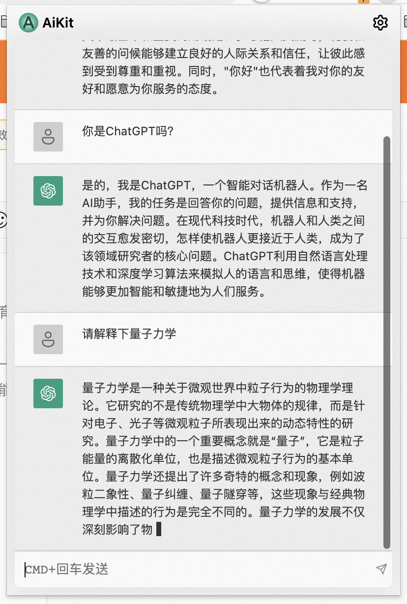
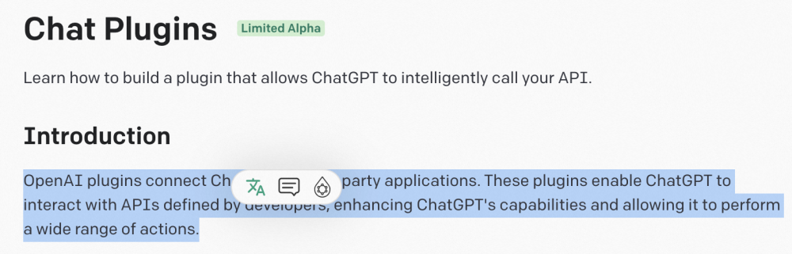
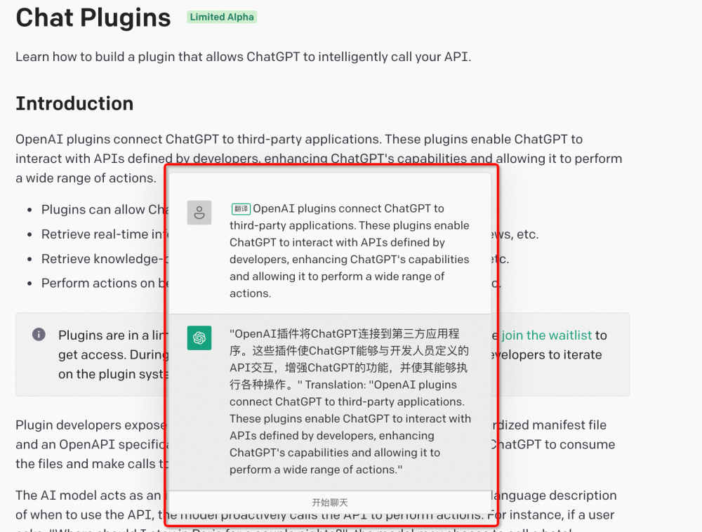
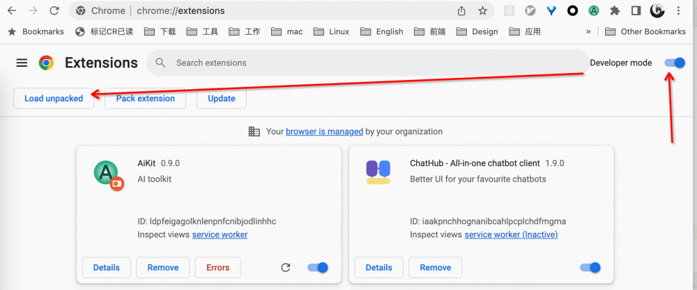
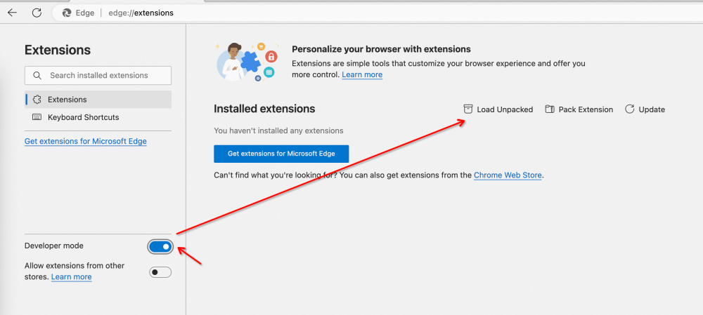

# AiKit

AiKit - AI工具箱

本项目参考并克隆自 [ChatGPT for Google](https://github.com/wong2/chatgpt-google-extension)，但是针对国内用户做了深度改造，已经是两个不同定位的产品。
目前插件处于预览版阶段，碰到问题可以微信留言，或者提项目issue，感谢你的反馈，我会择时处理。

## 产品介绍

基于`gpt-3.5-turbo-0301`封装的一个浏览器插件，目前支持Chrome、Edge、FireFox，提供
### 聊天交互功能

### 网页阅读小工具
可以用做翻译、摘要

## 如何安装
### 第一步：下载如下文件，并解压到你喜欢的路径
下载链接见[发布日志](https://www.yuque.com/wnow20/aikit/releases-notes)

### 第二步：
打开Chome插件管理，链接： chrome://extensions
或者打开 Edge插件管理，链接：edge://extensions/

开启开发者模式，并加载解压包：
Chrome如下：

Edge如下：

### TODOs
- [x] CMD+K 唤起智能框，类似Spotlight
- [x] 对话框，有新增消息是自动滚动到最后
- [x] Chat
- [x] 翻译、概述只读模式
- [x] options 改造及中文化
- [x] ChatGPT 错误提示
- [x] re-generate
- [x] popup
- [x] aikit provider
- [x] 弹框出现位置
- [x] 更换LOGO
- [x] 一键切换为AiKit官方接口
- chore
    - [x] 设置AiKit为默认的provider
- bugfixs
    - [x] 修复因为结构的变化导致ChatCard读取msg对象的错误
    - [x] 修复因为box-sizing未设置到只的样式问题
    - [x] 修复多个aikitContainer导致的子元素重复问题
    - [x] open ai proxy 改为nodejs代理
- [x] 支持gpt3.5 ChatCompletion & 上下文chat
- [x] 对话支持持久化
- [x] 支持历史消息清理
- [x] 非中国区支持ChatGPT
- Features
  - [ ] 调节对话框的大小
  - [ ] 阅读辅助对话框支持代码高亮、复制
  - [ ] 输入框没有记忆功能，切换一下就没了草稿
  - [ ] 独立聊天页面
  - 鼠标右键：翻译、summary、支持配置
  - 多语言
- issues
  - [ ] aikit 去除 twindcss class styles
- Chores
  - [ ] 编辑yuque文档
  - [ ] 分发：知乎帖子
  - [ ] 插件上架
